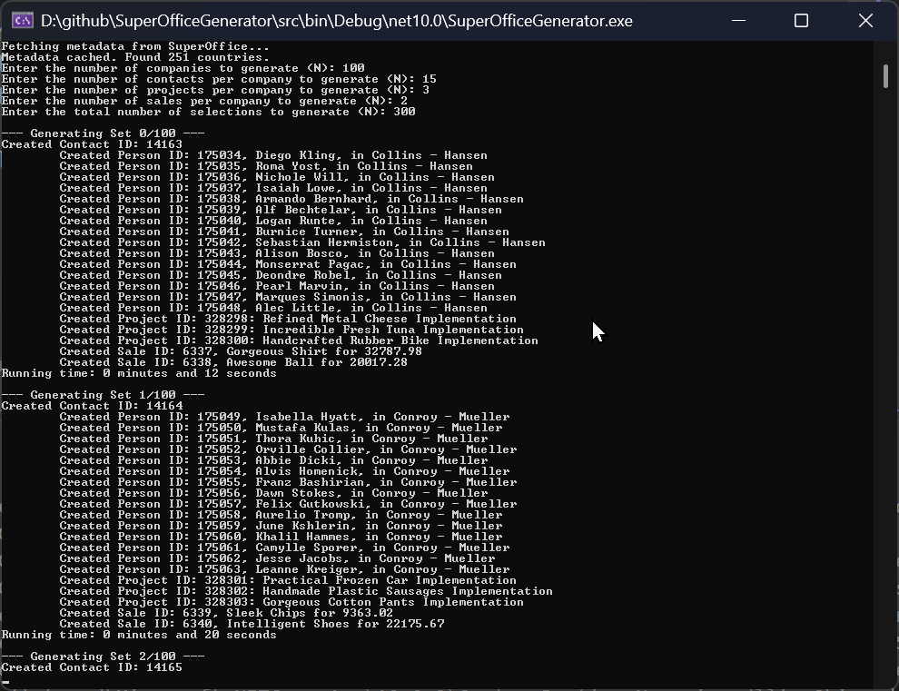
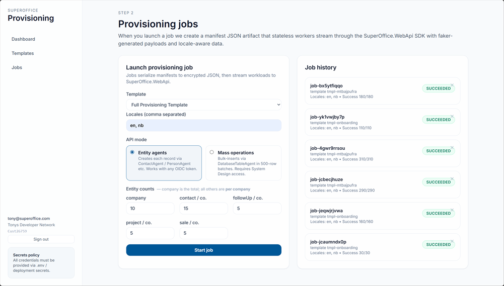
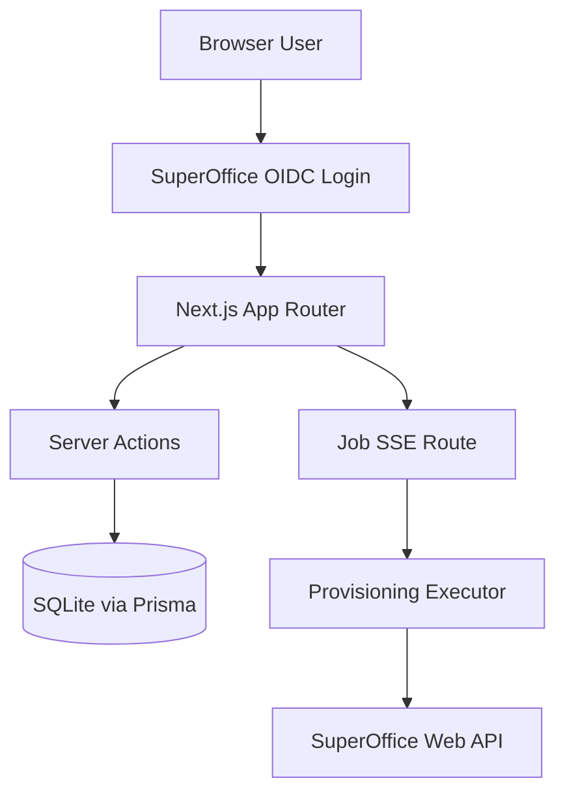

# SuperOffice Generator

This is a code generator for SuperOffice CRM. It generates n number of entities and pushes them to the CRM online.

## Repository Structure

This repository currently contains two application surfaces:

- `src`: the original .NET console generator
- `websrc`: the Next.js web application for browser-based provisioning

---

## Console Application




## Usage

1. Clone the repository and navigate to the src directory.
2. Update the `appsettings.json` file with your application client id and secret. See Developer Portal for more details: https://dev.superoffice.com
  * Must have one RedirectUri defined as `^http://127.0.0.1\:\d{4,10}$`
3. Build the project using the command:
   ```
   dotnet build
   ```
4. Run the application using the command:
   ```   
   dotnet run
   ```

## Web Application

The web application in `websrc` is a Next.js 14 App Router application that authenticates with SuperOffice, stores templates and job manifests in a local SQLite database (Prisma), and executes provisioning jobs through the SuperOffice Web API.



### Architecture Overview



Key runtime characteristics:

- templates and jobs are stored in a local SQLite database via Prisma
- queued jobs execute when the job detail page opens the SSE stream
- provisioning supports entity-agent mode and bulk mass-operations mode
- entities are executed in topological order based on `dependsOn` declarations
- custom (non-builtin) database tables are supported alongside the five builtin entity types

### Quick Start

```bash
cd websrc
npm install
npx prisma migrate dev
npm run dev
```

Open `http://localhost:3000` and sign in with a SuperOffice account.

See [websrc/README.md](websrc/README.md) for full setup, configuration, and how-to guides.

### Documentation

- [websrc/README.md](websrc/README.md) — setup, template configuration, and job execution guide
- [docs/websrc-application-specification.md](docs/websrc-application-specification.md)
- [docs/websrc-prd-gap-checklist.md](docs/websrc-prd-gap-checklist.md)
