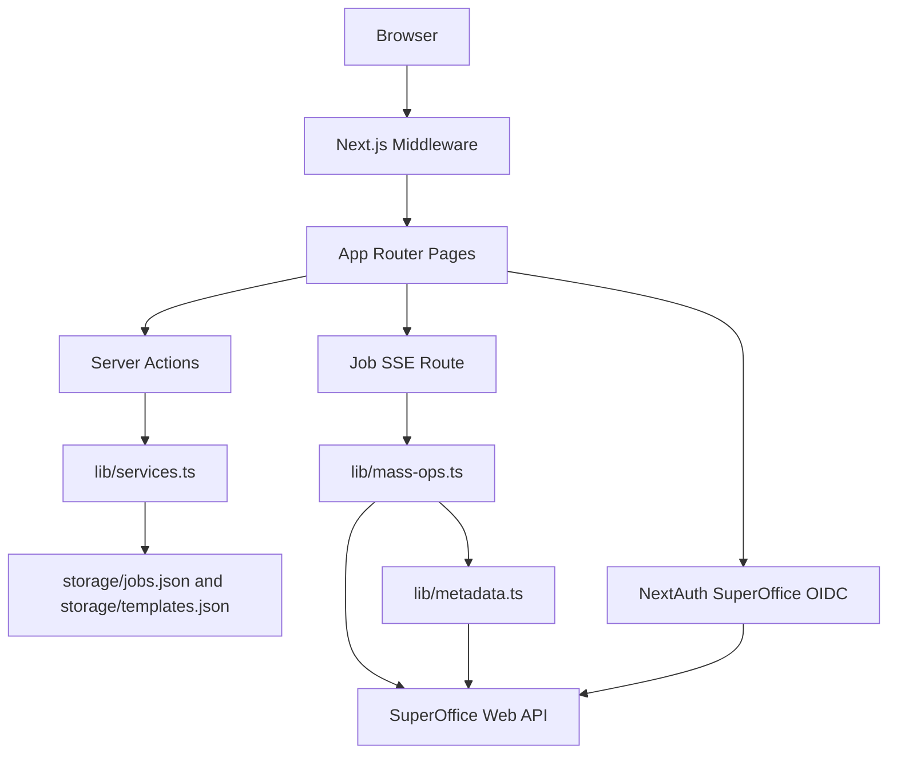

# SuperOffice Provisioning Portal Web Application Specification

## 1. Purpose

This document details the Next.js application implemented in `websrc` and describes its current behavior, architecture, runtime dependencies, and operator workflow.

It is intentionally based on the code that exists today, not only on the product requirements in `docs/web-app-prd.md`.

## 2. Executive Summary

The web application is a Next.js 14 App Router application that provides a browser UI for:

- authenticating against SuperOffice through OIDC using NextAuth/Auth.js,
- creating and editing provisioning templates stored as JSON,
- launching provisioning jobs stored as JSON manifests,
- executing those jobs against the SuperOffice Web API, and
- monitoring progress through Server-Sent Events.

The application uses server actions for mutations, JSON files under `websrc/storage` for persistence, and two execution modes for provisioning:

- `entity` mode, which creates records through high-level SuperOffice entity agents,
- `massops` mode, which bulk inserts rows through `DatabaseTableAgent`.

Although parts of the UI and comments describe storage as encrypted object storage, the current implementation persists plain JSON files locally in `websrc/storage`.

## 3. Technology Stack

## Frontend

- Next.js 14.2.x with App Router
- React 18
- TypeScript
- Tailwind CSS
- TanStack Query
- NextAuth v5 beta

## Backend-in-Next.js

- Server Components for page rendering
- Server Actions for template/job mutations
- Route Handlers for auth and SSE streaming
- File-based persistence using Node.js `fs/promises`

## External Integration

- `@superoffice/webapi` for entity and metadata access
- `@faker-js/faker` for generated payload values
- SuperOffice OIDC provider for user sign-in

## 4. High-Level Architecture



## 5. Runtime Model

The application is a single Next.js project where UI, orchestration, and API integration all run in the same deployment unit.

There is no separate worker process. Job execution is triggered lazily when a user opens a job detail page and the browser establishes an EventSource connection to the SSE route:

- a job is first created with status `queued`,
- the job remains queued until `/jobs/[id]` is opened,
- the `JobStreamWatcher` client component opens `/api/jobs/[id]/stream`,
- the server route marks the job `running` and performs the provisioning work,
- progress events stream back to the browser,
- final metrics and status are persisted into `jobs.json`.

This means the job runner is coupled to the lifetime of the SSE request and is not currently an independent background processor.

## 6. Route Inventory

## UI Routes

### `/login`

- Public route.
- Presents a server-action form that calls `signIn("superoffice")`.
- Used as the custom NextAuth sign-in page.

### `/`

- Protected by middleware.
- Dashboard page showing template count, job count, success rate, and the latest jobs.
- Reads from `listJobs`, `listTemplates`, and `summarizeDashboard`.

### `/templates`

- Protected by middleware.
- Template management screen.
- Left side: JSON-based template editor.
- Right side: existing template list with edit and delete actions.
- Supports `?edit=<templateId>` to load a template into edit mode.

### `/jobs`

- Protected by middleware.
- Job creation form and job history list.
- Allows selecting a template, locales, per-entity counts, and API mode.

### `/jobs/[id]`

- Protected by middleware.
- Displays job summary, requested counts, selected API mode, and live progress.
- If the job is queued or running, the page starts SSE-based execution/monitoring.

## API / Route Handlers

### `/api/auth/[...nextauth]`

- NextAuth/Auth.js route handler.
- Handles OIDC login, callback, session, and logout mechanics.

### `/api/jobs/[id]/stream`

- SSE endpoint.
- Requires an authenticated session with an access token.
- Executes queued jobs and emits `phase_start`, `batch_done`, `phase_done`, `job_done`, and `error` events.
- Also returns a synthetic `job_done` event for already-completed jobs.

## 7. Authentication and Authorization

Authentication is implemented with NextAuth v5 beta using a custom OIDC provider configuration for SuperOffice.

## Implemented Behavior

- Provider id is `superoffice`.
- OIDC issuer defaults to `https://sod.superoffice.com` unless overridden.
- PKCE and state checks are enabled.
- The token endpoint is explicitly configured because SuperOffice discovery does not expose a `userinfo_endpoint` in the expected format.
- User info is assembled by:
  - decoding the `id_token` to extract `webapi_url` and tenant claims,
  - calling `v1/User/currentPrincipal` with the access token,
  - merging the two payloads.
- Session data includes:
  - `accessToken`
  - `webApiUrl`
  - `ctx`
  - `companyName`
  - optional `systemUserToken`

## Route Protection

Middleware protects all routes except:

- `/login`
- `/api/auth/*`
- Next.js static assets
- image optimization assets
- `favicon.ico`

Unauthenticated users are redirected to `/login`.

## Current Authorization Model

The PRD describes operator/admin roles, but the current implementation does not enforce role-based authorization.

- Any authenticated user can access the protected pages.
- Mutating operations do not check user role.
- `createdBy` is currently hard-coded as `operator` when templates and jobs are written.

## 8. Persistence Model

The application uses file-based storage rooted at `websrc/storage`.

## Files

- `storage/templates.json`
- `storage/jobs.json`

## Behavior

- The storage directory is created automatically if missing.
- Missing JSON files are auto-seeded.
- Templates are seeded with one built-in example: `tmpl-onboarding`.
- Jobs start with an empty list.
- JSON is written with pretty formatting.

## Important Implementation Note

The UI text and PRD refer to encrypted JSON/object storage, but the actual implementation stores unencrypted JSON on the local filesystem. This is one of the biggest architectural gaps between the specification target and the current build.

## 9. Data Model

## TemplateDefinition

A template is a JSON object with:

- `id`
- `name`
- `description`
- `entities[]`
- `createdBy`
- `updatedAt`

Each entity entry contains:

- `entityType`: `company | contact | followUp | project | sale`
- `quantityDefault`
- `localeFallbacks[]`
- `fields[]`

Each field rule contains:

- `field`
- `strategy`: `static | faker | list | sequence`
- optional `value`
- optional `fakerPath`
- optional `list[]`

## JobManifest

A job manifest contains:

- `id`
- `templateId`
- `locales[]`
- `requestedCounts`
- `apiMode`: `entity | massops`
- `status`: `queued | running | succeeded | failed`
- `createdBy`
- `createdAt`
- optional `completedAt`
- `metrics`
- `items[]`
- optional `phases`

## Important Implementation Note

`items[]` exists in the manifest shape but is not populated by the current execution pipeline. Per-record payloads, created IDs, and detailed failures are therefore not persisted, even though the type model suggests they could be.

## 10. Template System

Templates are edited as raw JSON through a large textarea-based form.

## Supported Entity Types

- `company`
- `contact`
- `project`
- `sale`
- `followUp`

In this application, the template entity type `contact` maps to the SuperOffice `person` entity/table.

## Supported Field Strategies

### `static`

Uses a fixed string value.

### `faker`

Executes a faker path such as:

- `company.name`
- `person.firstName`
- `person.lastName`
- `commerce.productName`
- `finance.amount`

### `list`

Randomly selects a value from a provided list.

### `sequence`

Generates an uppercase alphanumeric token.

## Validation

Server actions validate template JSON with Zod before saving.

Validation includes:

- minimum name and description length,
- allowed entity types,
- allowed strategy values,
- quantity minimums,
- basic locale and field structure.

## Current UX Characteristics

- There is no structured form builder yet.
- Operators must edit JSON directly.
- Template preview endpoints from the PRD are not implemented.

## 11. Job Creation Model

Jobs are created from the `/jobs` page using a server action.

## Operator Inputs

- template selection
- locale list as comma-separated text
- API mode selection
- per-entity counts

## Count Semantics

The UI explicitly states that:

- `company` count is the total number of companies,
- all other counts are per company.

That behavior is implemented in both execution modes.

For example, if:

- `company = 10`
- `contact = 5`

then the execution pipeline attempts to create 50 contacts, not 5 total contacts.

## Locale Handling

If no locales are supplied at job creation time, the application aggregates locale fallbacks from the selected template.

However, execution currently only uses the first locale in `manifest.locales`. The faker wrapper does not switch locale implementations at runtime, so locale support is mostly declarative at the moment.

## 12. Provisioning Execution Architecture

The application supports two execution paths.

## A. Entity-Agent Mode

This mode uses high-level SuperOffice agents from `@superoffice/webapi`:

- `ContactAgent`
- `PersonAgent`
- `ProjectAgent`
- `AppointmentAgent`
- `SaleAgent`

### Characteristics

- concurrency is fixed at 5 simultaneous API calls,
- records are created entity-by-entity,
- relationships are stitched together in memory using IDs created in earlier phases,
- this mode works with a regular authenticated OIDC access token.

### Entity Relationships

- contacts/persons are attached to companies using round-robin assignment,
- projects are created after companies and persons,
- project members are added based on company/person alignment,
- sales attach to company, person, and optional project,
- follow-ups attach to company and optionally person, project, and sale.

## B. Mass Operations Mode

This mode uses `DatabaseTableAgent.insertAsync` to perform bulk inserts.

### Characteristics

- batch size is fixed at 500 rows,
- inserts target physical tables directly,
- system columns and foreign keys are synthesized by schema definitions,
- secondary tables are also populated for some entity types.

### Authentication Options

Mass operations prefer a system-user ticket when the SuperOffice `system_token` claim is present in the session.

The flow is:

1. sign the `system_token` using the configured RSA private key,
2. call `PartnerSystemUser/Authenticate`,
3. decode the returned JWT,
4. extract the `ticket` claim,
5. authenticate `DatabaseTableAgent` with `Authorization: SOTicket <ticket>` and `SO-AppToken`.

If no system-user token is available, the code falls back to bearer-token access.

### Direct Table Mapping

The schema layer maps template entity types to SuperOffice tables:

- `company` -> `contact`
- `contact` -> `person`
- `project` -> `project`
- `sale` -> `sale`
- `followUp` -> `appointment`

### Secondary Table Population

The implementation inserts related rows for some entities:

- persons create `phone` and `email` rows when values are available,
- follow-ups create a secondary `appointment` booking/invitee row,
- projects create `projectmember` rows.

## Phase Order

Both execution modes use the same dependency-aware order:

1. `company`
2. `contact`
3. `project`
4. `sale`
5. `followUp`

If no company IDs are created, dependent phases stop.

## 13. Metadata Resolution

Before inserts begin, the application fetches and caches tenant metadata for 10 minutes.

Metadata includes:

- countries
- businesses
- categories
- project types
- project statuses
- sale types
- sources
- tasks
- current user associate id
- current user primary group id
- default probability id

This metadata is used to populate required fields and defaults that are not captured directly in templates.

## 14. UI Composition

## Layout

The root layout provides:

- a left sidebar on medium+ screens,
- navigation links for Dashboard, Templates, and Jobs,
- an auth status block with tenant context details,
- a central content container for each page.

## Styling

- Tailwind CSS drives all styling.
- There is a minimal design token setup with a single `brand` palette extension.
- Global reusable classes include `card` and `pill`.

## Data Fetching

- Most page-level data fetching happens in Server Components.
- TanStack Query is registered globally but is not heavily used by the current pages.
- `SessionProvider` is used so client components can access auth state.

## 15. How to Use the Application

## Prerequisites

The application expects a working SuperOffice OIDC application and environment variables for auth.

### Required or Effectively Required Variables

- `SUPEROFFICE_CLIENT_ID`
- `SUPEROFFICE_CLIENT_SECRET`
- `SUPEROFFICE_ISSUER` if not using the default `https://sod.superoffice.com`

### Required for Mass Operations with System User Authentication

- `SUPEROFFICE_PRIVATE_KEY`

### Typical NextAuth Variables

Because NextAuth/Auth.js is used, deployment typically also needs the usual auth settings such as:

- `AUTH_SECRET` or `NEXTAUTH_SECRET`
- `AUTH_URL` or `NEXTAUTH_URL`

## Local Startup

```bash
cd websrc
npm install
npm run dev
```

Open `http://localhost:3000` and sign in with a SuperOffice account.

## Operator Workflow

### 1. Sign in

- Open the application.
- Authenticate with SuperOffice from `/login`.

### 2. Create or edit a template

- Navigate to `/templates`.
- Edit the JSON template definition.
- Save the template.

### 3. Launch a job

- Navigate to `/jobs`.
- Select a template.
- Optionally provide locales.
- Select `Entity agents` or `Mass operations`.
- Provide counts for company and any dependent entities.
- Submit the form.

### 4. Monitor execution

- The app redirects to `/jobs/[id]`.
- Opening this page starts execution if the job is still queued.
- Live progress updates stream into the page.

### 5. Review history

- Return to `/jobs` to view completed jobs.
- Open a job to see summary metrics and phase totals.

## 16. Implemented Features vs PRD

## Implemented Today

- SuperOffice OIDC login
- protected App Router pages
- template CRUD backed by JSON storage
- job creation backed by JSON manifests
- live job execution through SSE
- entity-agent provisioning mode
- mass-operations provisioning mode
- tenant metadata caching
- dashboard and history views

## Not Yet Implemented or Only Partially Implemented

- environment management UI
- admin/operator role enforcement
- object storage or encrypted persistence
- template preview endpoint
- job export endpoint
- retry failed rows
- per-item audit logs in manifests
- notifications and audit retention
- scheduled jobs
- template versioning and diffing
- true locale-aware faker behavior
- detached background workers or queue infrastructure

## 17. Operational Limitations and Risks

## Execution Coupled to Browser Session

Jobs only begin when the detail page opens the SSE endpoint. This means job execution currently depends on an active request path instead of a dedicated background worker.

## Plain JSON Persistence

Templates and jobs are stored unencrypted on the local filesystem. This does not satisfy the security posture implied by the PRD.

## Limited Audit Depth

Final metrics and phase summaries are stored, but detailed inserted payloads and per-row outcomes are not persisted.

## Locale Support Is Superficial

Template locales and job locales exist, but faker locale switching is not actually implemented. The default faker instance is always used.

## Broad Server Action Origin Setting

`next.config.mjs` enables server actions with `allowedOrigins: ["*"]`. That is permissive and should be reviewed for production deployment.

## Console Logging of Sensitive Flow Details

The system-user authentication helper logs diagnostic information around token signing and responses. That may be useful for development, but it should be tightened before production use.

## 18. Suggested Next Architecture Steps

If the application is to move toward the PRD target, the most important next changes are:

1. Replace local JSON persistence with encrypted storage or a secure backing service.
2. Decouple job execution from the browser by introducing a background worker or queue.
3. Implement real environment management and role-based authorization.
4. Persist per-item execution details so exports, retries, and audits are possible.
5. Implement real locale-specific faker selection.

## 19. Source of Truth

This specification reflects the implementation in `websrc` as of March 15, 2026.

When this document conflicts with `docs/web-app-prd.md`, the PRD describes intended product direction while this specification describes the current codebase behavior.