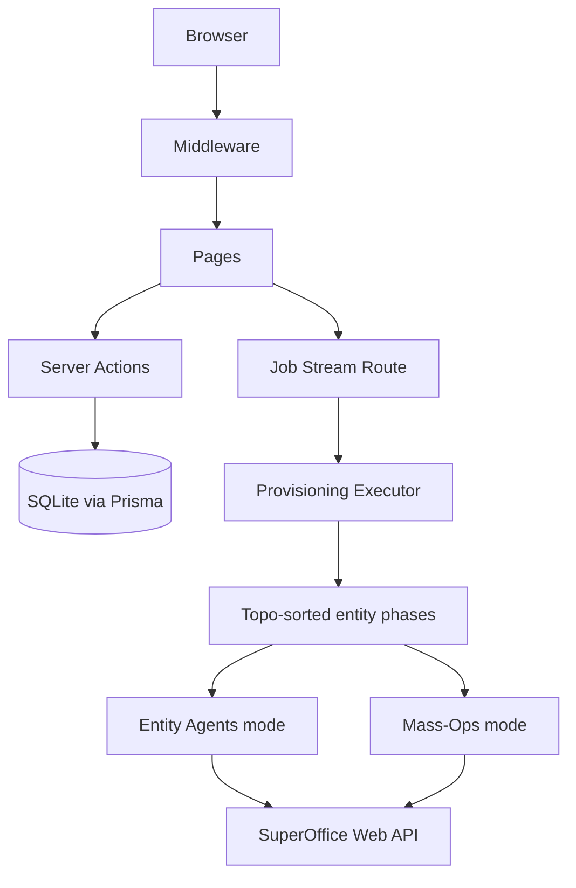

# SuperOffice Provisioning Portal

A Next.js 14 web application for provisioning SuperOffice CRM data from a browser. Authenticate with SuperOffice, define reusable data templates, and run bulk provisioning jobs with live progress streaming.

Built with: Next.js 14 App Router · NextAuth/Auth.js · Tailwind CSS · Prisma + SQLite · `@superoffice/webapi` · `@faker-js/faker`

---

## What It Does

- Authenticates users against SuperOffice via OIDC.
- Stores provisioning templates and job manifests in a local SQLite database (via Prisma).
- Creates CRM data in two modes:
  - `entity` — high-level SuperOffice entity agents (ContactAgent, PersonAgent, etc.)
  - `massops` — bulk inserts via `DatabaseTableAgent` in 500-row batches
- Streams live job progress to the browser using Server-Sent Events.

---

## Requirements

### Environment variables

Create a `.env.local` file in `websrc/`:

```env
# Required
SUPEROFFICE_CLIENT_ID=your-client-id
SUPEROFFICE_CLIENT_SECRET=your-client-secret
DATABASE_URL=file:./dev.db

# Recommended
AUTH_SECRET=a-random-secret-string
AUTH_URL=http://localhost:3000

# Optional — defaults to SuperOffice Online SOD environment
SUPEROFFICE_ISSUER=https://sod.superoffice.com

# Required for mass-operations system-user authentication
SUPEROFFICE_PRIVATE_KEY=your-rsa-private-key
```

Your SuperOffice application (registered at [dev.superoffice.com](https://dev.superoffice.com)) must include the redirect URI:

```text
http://localhost:3000/api/auth/callback/superoffice
```

---

## Local Development

```bash
cd websrc
npm install
npx prisma migrate dev   # creates the SQLite database
npm run dev
```

Open `http://localhost:3000`.

---

## Operator Workflow

1. Sign in with a SuperOffice account.
2. Go to **Templates** and create or edit a template.
3. Go to **Jobs**, select a template, configure counts, and start a job.
4. Watch live execution on the job detail page.
5. Return to **Jobs** for history and summary metrics.

---

## How To: Configure Templates

Templates define *what* data to create. Each template contains one or more **entity definitions** — either builtin SuperOffice entity types or custom database tables.

### Open the Template Builder

Navigate to `/templates`. The left panel is the template form; existing templates are listed on the right.

### Create a Template

1. Enter a **Name** and **Description**.
2. Add entities using the **+ Builtin** or **+ Custom table** buttons.
3. Click **Save template**.

To edit an existing template, click **Edit** on its card. To copy one, click **Duplicate**.

---

### Builtin Entities

Click **+ Builtin** to add a SuperOffice entity. The dropdown shows the available types:

| Type | SuperOffice Object | DB Table |
| --- | --- | --- |
| `company` | Contact (organisation) | `contact` |
| `contact` | Person | `person` |
| `followUp` | Appointment | `appointment` |
| `project` | Project | `project` |
| `sale` | Sale | `sale` |

Each entity card has:

- **Builtin type selector** — switch the type. Changing the type resets fields to defaults.
- **Name** — internal identifier used for FK references and job counts. Defaults to the type name.
- **qty** — default number of records to create. For dependent entities this is *per company*.
- **locales** — comma-separated locale codes, e.g. `en, nb, de`. The first job locale the entity supports is used; the list is a fallback chain.
- **depends on** — comma-separated names of entities that must run first, e.g. `company, contact`. Builtin types are pre-wired with correct defaults.

#### Default field sets per builtin type

| Type | Default fields |
| --- | --- |
| `company` | name, phone, email |
| `contact` | firstName, lastName, mobile |
| `followUp` | title |
| `project` | name |
| `sale` | heading, amount |

---

### Custom Table Entities

Click **+ Custom table** to define an entity that maps to any arbitrary database table. Fill in:

- **Name** — unique identifier within this template.
- **Builtin type** — set to `— custom —`.
- **table** — the physical DB table name, e.g. `udcontactsmall`.
- **PK** — the primary key column, e.g. `udcontactsmall_id`. Set the value to `"0"` (or leave auto-generated) to trigger an INSERT.
- **depends on** — entities that must run before this one (comma-separated names).
- Fields and secondary tables as described below.

---

### Fields

Each entity has a list of field rules. Click **+ Add field** inside an expanded entity card.

Every field row has:

- **Field name** — the template field name (mapped to a DB column via the builtin schema's `fieldMap`, or used as-is for custom entities).
- **Strategy** — how the value is generated.
- **Value / path** — strategy-specific configuration.

#### Strategies

| Strategy | Description | Extra input |
| --- | --- | --- |
| `faker` | Calls a Faker.js path. Uses the resolved locale. | Faker path, e.g. `company.name`, `person.firstName`, `lorem.sentence` |
| `static` | A fixed literal value for every row. | The literal value |
| `list` | Picks randomly from a comma-separated list. | e.g. `Hot, Warm, Cold` |
| `sequence` | Generates a random 8-character alphanumeric string. | (none) |
| `fk` | Injects a primary key from a previously-run entity. | Entity name + selection mode (`round-robin` or `random`) |

#### FK strategy

Use `fk` to wire a field to another entity's inserted IDs. For example, to link a custom table row to a contact person:

- **Field name**: `person_id`
- **Strategy**: `fk`
- **FK entity**: `contact` (or whatever name you gave the contact entity)
- **Selection mode**: `round-robin` (cycles through all inserted IDs in order) or `random`

The FK entity must appear before this entity in the dependency order.

---

### Secondary Tables

Each entity can declare **secondary tables** — additional DB tables that receive one row per parent row. Click **+ Add table** inside an expanded entity card.

Each secondary table requires:

- **table name** — the physical DB table name.
- **PK** — the primary key column (set to `"0"` to INSERT).
- **FK col** — the column in this secondary table that stores the parent row's primary key (injected automatically).
- **Fields** — same field rule format as the parent entity.

Example: a `notes` secondary table attached to a `company` entity:

```text
table name:  note
PK:          note_id
FK col:      contact_id
fields:
  text    faker   lorem.paragraph
  type    static  1
```

---

### Template Preview

On any existing template card, click **Preview** to generate one sample row per entity using the template's faker paths and resolved locales. Click **↺ Refresh** to regenerate.

---

## How To: Add and Execute Jobs

Jobs apply a template to your live SuperOffice tenant.

### Create a Job

1. Navigate to `/jobs`.
2. Select a **template** from the dropdown. Entity count fields populate with the template's defaults.
3. Enter **Locales** (comma-separated), e.g. `nb, en`. The executor picks the best matching locale per entity based on the entity's `localeFallbacks`.
4. Choose an **API mode**:
   - **Entity agents** — uses `ContactAgent`, `PersonAgent`, etc. Works with any OIDC token. Slower for large volumes.
   - **Mass operations** — uses `DatabaseTableAgent.insertAsync` in 500-row batches. Much faster for large volumes. Requires **System Design** access and `SUPEROFFICE_PRIVATE_KEY` to be set.
5. Adjust **Entity counts** if needed. Each count is the number of records *per company* (except company itself, which is the absolute total).
6. Click **Start job**.

You are redirected to the job detail page immediately.

### Monitor Live Execution

The job detail page opens an SSE stream to `/api/jobs/[id]/stream`, which starts execution. You will see:

- A progress bar per entity phase.
- Batch-level insert counts as they complete.
- Error events if individual inserts fail (non-fatal — the phase continues).
- A final summary with total inserted, failed, and duration.

The job remains in `queued` state until the detail page is opened. If you close the page mid-run, reopen it — the stream will resume from the current state.

### Review Job History

Navigate to `/jobs` to see all past jobs with their status, template name, entity counts, and duration. Jobs stay in history indefinitely.

---

## Route Summary

| Route | Purpose |
| --- | --- |
| `/login` | Sign-in page |
| `/` | Dashboard |
| `/templates` | Template builder and list |
| `/jobs` | Job creation form and history |
| `/jobs/[id]` | Live job progress and summary |
| `/api/jobs/[id]/stream` | SSE execution stream |
| `/api/templates/[id]/preview` | Template preview (one sample row per entity) |

---

## Architecture



### Execution engine

- Entities within a template are executed in **topological order** based on their `dependsOn` declarations.
- Each entity phase receives the inserted primary keys from all prior phases, enabling FK injection.
- Builtin entity types resolve against fixed `EntitySchema` definitions (table name, column map, system columns).
- Custom entities build a schema at runtime from `tableName` / `primaryKey` / `fields`.
- Secondary tables are populated immediately after their parent's batch completes.
- Locale is resolved per entity: the first job locale that appears in the entity's `localeFallbacks` wins; falls back to the first fallback locale.
