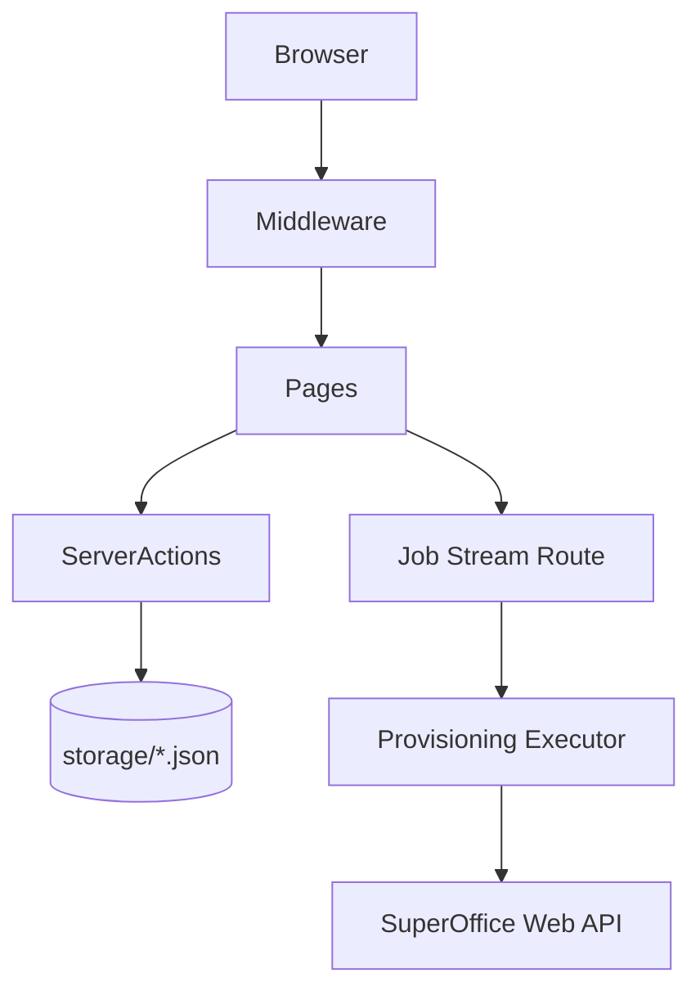

# SuperOffice Provisioning Portal

This is the Next.js web application for provisioning SuperOffice CRM data from a browser instead of the .NET console application in `src`.

It is built with Next.js 14, App Router, NextAuth/Auth.js, Tailwind CSS, `@superoffice/webapi`, and `@faker-js/faker`.

## What It Does

- Authenticates users against SuperOffice using OIDC.
- Stores provisioning templates in `storage/templates.json`.
- Stores job manifests and execution summaries in `storage/jobs.json`.
- Creates CRM data in two modes:
	- `entity`: high-level SuperOffice entity agents
	- `massops`: bulk inserts through `DatabaseTableAgent`
- Streams live job progress to the browser using Server-Sent Events.

## Important Current Behavior

- Persistence is currently local file-based JSON under `websrc/storage`.
- Jobs are created in `queued` state and only start running when the job detail page opens its SSE stream.
- Locale fields exist in templates and jobs, but faker currently uses the default runtime locale only.
- The app does not yet implement environment management, export endpoints, retry flows, or role-based authorization.

For the full reverse-engineered implementation spec, see [../docs/websrc-application-specification.md](../docs/websrc-application-specification.md).

For the PRD gap checklist, see [../docs/websrc-prd-gap-checklist.md](../docs/websrc-prd-gap-checklist.md).

## Requirements

Minimum application configuration:

- `SUPEROFFICE_CLIENT_ID`
- `SUPEROFFICE_CLIENT_SECRET`
- `SUPEROFFICE_ISSUER` if not using `https://sod.superoffice.com`

Recommended auth/runtime configuration:

- `AUTH_SECRET` or `NEXTAUTH_SECRET`
- `AUTH_URL` or `NEXTAUTH_URL`

Required for mass-operations system-user authentication:

- `SUPEROFFICE_PRIVATE_KEY`

## Local Development

```bash
cd websrc
npm install
npm run dev
```

Open `http://localhost:3000`.

## Operator Workflow

1. Sign in with a SuperOffice account.
2. Create or edit a JSON template on `/templates`.
3. Start a job on `/jobs` using either `entity` or `massops` mode.
4. Review live execution on `/jobs/[id]`.
5. Revisit `/jobs` for history and summary metrics.

## Route Summary

- `/login`: sign-in page
- `/`: dashboard
- `/templates`: template CRUD UI
- `/jobs`: job creation and history
- `/jobs/[id]`: job detail and live progress
- `/api/auth/[...nextauth]`: auth handler
- `/api/jobs/[id]/stream`: SSE execution stream

## Architecture Snapshot


